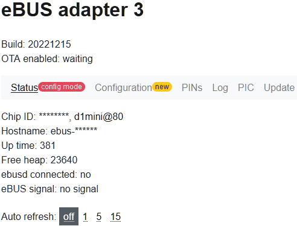
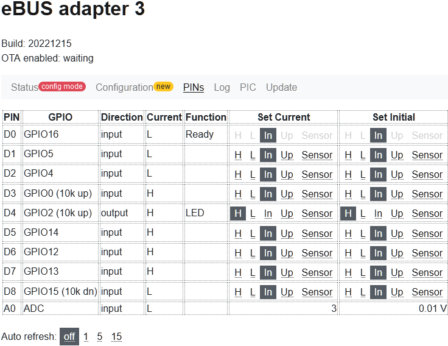

# ebusd-esp
Firmware for ESP8266, ESP8285, and ESP32 allowing eBUS communication for ebusd with lowest possible latency.

## History
For a history of version and changes made therein, see the [change log](Changelog.md).


## Flashing
First of all, you need to flash the firmware to the ESP board. Currently, the following boards are supported and
require flashing the corresponding binary:

* [Wemos D1 mini](https://www.wemos.cc/en/latest/d1/d1_mini.html):  
  * chip: ESP8266
  * flash size: 4MB
  * firmware: [d1mini](dist/ebus-v3_d1mini.bin)
* [Wemos D1 mini Lite](https://www.wemos.cc/en/latest/d1/d1_mini_lite.html):  
  * chip: ESP8285
  * flash size: 1MB
  * firmware: [d1mini_lite_1m](dist/ebus-v3_d1mini_lite_1m.bin)
* [Wemos D1 mini Pro](https://www.wemos.cc/en/latest/d1/d1_mini_pro.html):  
  * chip: ESP8266
  * flash size: 16MB
  * firmware: [d1mini_pro_16m](dist/ebus-v3_d1mini_pro_16m.bin)
  * attention: some boards are sold as "pro" but are actually equipped with 4MB flash only. These need to be flashed
    with the [d1mini](dist/ebus-v3_d1mini.bin) variant instead of the pro!
* [NodeMcu v1.0](https://github.com/nodemcu/nodemcu-devkit-v1.0):  
  * chip: ESP8266
  * flash size: 4MB
  * firmware: [nodemcu1](dist/ebus-v3_nodemcu1.bin)
* [ESP-01S](http://www.ai-thinker.com/pro_view-60.html):
  * chip: ESP8266
  * flash size: 1MB
  * firmware: [esp01](dist/ebus-v3_esp01.bin)
* [Wemos D32](https://www.wemos.cc/en/latest/d32/d32.html) (aka Lolin32):  
  * chip: ESP-WROOM-32
  * flash size: 4MB
  * firmware: [lolin32](dist/ebus-v3_lolin32.bin)
  * first time flashing: use [factory image](dist/ebus-v3_lolin32_factory.bin), see [note on "factory" image below](README.md#flashing-with-esptool)
* [D1 mini 32](https://forum.mhetlive.com/topic/8/mh-et-live-minikit-for-esp32):
  * chip: ESP-WROOM-32
  * flash size: 4MB
  * firmware: [d1mini32](dist/ebus-v3_d1mini32.bin)
  * first time flashing: use [factory image](dist/ebus-v3_d1mini32_factory.bin), see [note on "factory" image below](README.md#flashing-with-esptool)

Other boards might work as well, but were not tested.

In order to flash the firmware to the ESP board, you need one of the tools mentioned on
[NodeMCU](https://nodemcu.readthedocs.io/en/release/flash/#tool-overview), e.g.:
* [esptool.py](https://nodemcu.readthedocs.io/en/release/flash/#esptoolpy),
* [NodeMCU Flasher](https://github.com/nodemcu/nodemcu-flasher), or
* [esptool](https://github.com/igrr/esptool-ck/releases).

Using that tool, simply flash the right binary from the
[dist folder](https://github.com/john30/ebusd-esp/tree/master/dist) to the ESP board.
Erasing the flash before might be a good idea (if you don't want to keep the settings).

### Flashing with NodeMCU Flasher
For the [NodeMCU Flasher](https://github.com/nodemcu/nodemcu-flasher), first pick the right file for your board from the
[dist folder](https://github.com/john30/ebusd-esp/tree/master/dist) and set the address to 0x0000:  


Then adjust the transfer settings according to your board (settings for Wemos D1 mini shown):  


And finally, start the upload by pressing Flash:  


### Flashing with esptool
For the [esptool](https://github.com/igrr/esptool-ck/releases) flasher, just run it on command line like this
(replacing COM4 with the corresponding port on Windows or the right serial device like /dev/ttyUSB0 under Linux, and
replacing ebus-v3_d1mini.bin with the right filename for your board):  
`esptool -cp COM4 -bm dio -cd nodemcu -cb 921600 -ce -cf ebus-v3_d1mini.bin`

### Flashing ESP32 images
For all ESP32 images, the first flashing of a blank or otherwise differently flashed device has to be done with the image
having "_factory" as suffix in the name, e.g. [ebus-v3_lolin32_factory.bin](dist/ebus-v3_lolin32_factory.bin). This
contains all relevant parts to get the device up and running.


## Configuration
The firmware can be configured with a simple HTML frontend or by using the serial link (using the onboard USB serial
converter).

### Configuration with serial link
Simply connect with e.g. Putty to the COM port at 115200 Baud (8N1) after connecting the board to your computer, and you
will see the following configuration options:

```
Welcome to eBUS adapter 3, build 20211226
Configured as WIFI access point EBUS without password.
For configuration with web browser, connect to this WIFI and open http://192.168.4.1/
Entering configuration mode.
Chip ID: ********, d1mini
Hostname: ebus-******

Configuration (new):
 1. WIFI SSID: EBUS
 2. WIFI secret:
 3. WIFI IP address: DHCP (failed: disconnected, reason: 1)
 w. WIFI power: normal
 W. WIFI phy mode: 11N
 4. WIFI hostname: ebus-******
 5. eBUS RX+TX PINs: Adapter 3 RX+TX (GPIO3+1)
 6. ebusd connection: enhanced on port 9999
 7. HTTP TCP port: 80
 8. LED PINs: RX:disabled, TX:disabled
 9. Initial PINs: D4:H

 p. Set current PINs: D4:H
 t. Toggle current output PIN
 s. Scan & read sensors
 c. Connect WIFI
 e. Dump EEPROM content
 f. Load factory settings
 F. Factory reset (i.e. erase EEPROM)
 o. OTA enabled: waiting
 r. Reboot (without saving)
 0. Save configuration and reboot

Enter your choice:
```

By entering one of the characters at the start of each configuration line and pressing ENTER, you can change the
corresponding configuration item or initiate the action behind it.

Once you have entered the desired data and verified their correctness, press "0" for saving the configuration and
rebooting the device.

For WIFI connection, you can try the connection (after SSID and secret were set) by using "c" and ENTER.

### Configuration with HTML frontend
After flashing, the device acts as an WIFI access point with SSID "EBUS", no password, and IP address "192.168.4.1".

The HTTP TCP port is set to port 80 by default. By entering the IP address of the device in a web browser, a status page
like this is shown:

[](http://192.168.4.1/)

The main configuration settings can be changed similarly to the serial link interface (not all options are available
though) by clicking on [Configuration](http://192.168.4.1/config):

[](http://192.168.4.1/config)

Use "Check & Update" to check your input and if no error message appeared and after you have verified the correctness of
the values, simply press "Save & Reset" to save the changes and reboot the device.

It is also possible to change PINs directly on the [PINs](http://192.168.4.1/pins) page:

[](http://192.168.4.1/pins)

If you want to change the initial PIN settings, just use the last column for that and afterwards go to the
[Configuration](http://192.168.4.1/config) page and press "Save & Reset" to save the changes and reboot the device.

Support for 1-wire temperature sensors is experimental, so handle with care. Once a PIN is configured as sensor PIN, the
connected sensors are scanned and sensor data can be retrieved with the "[/sensor](http://192.168.4.1/sensor)" URL in JSON
format and show up in the HTML frontend.

## LED
The onboard LED is used to give some feedback about the current state.

During reset, it usually blinks shortly as some data is sent on the debug output (which usually is connected to the
onboard LED).

The LED status after the reset depends on the selected eBUS RX+TX PIN mode.

### LED in hardware UART (direct or swapped) and mixed RX + software D2 eBUS RX+TX PIN mode
When in one of these eBUS RX+TX PIN modes, the LED provides the following feedback:
- After reset, it blinks two times slowly to indicate it was (re-)started.
- While establishing the WIFI connection, it dims down from on several times up to 5 seconds.
- When the WIFI connection was successfully established, it is switched off for around 5 seconds.
  During that time (when no eBUS signal was detected), sending any key to the serial port makes the firmware go to
  serial configuration mode.
- When an ebusd instance has connected successfully to the TCP/UDP port and there is a steady eBUS signal, then the LED
  is turned on permanently either at full brightness (if ebusd regularly sends something to the eBUS) or less brightness
  (if ebusd does not write to the eBUS).

If anything goes wrong during these steps, the LED will turn off. So everything is fine only if the LED is on
permanently at full or less brightness.

### LED in mixed software D1 + TX1 D4 eBUS RX+TX PIN mode
When the RX+TX PIN mode is set to mixed software D1 + TX1 D4 mode, the onboard LED will blink when something is sent
actively from the board on the eBUS only.


## PINs
If the HTTP port is configured, you can use the "/pin" URL for changing the value of an output PIN or reading the
current status of all PINs in JSON format including the analog input PIN.

E.g. in order to set D0 (GPIO16) to LOW, you could use the URL
[http://192.168.4.1/pin?pin=0&mode=l](http://192.168.4.1/pin?pin=0&mode=l), and using
[http://192.168.4.1/pin?pin=0&mode=h](http://192.168.4.1/pin?pin=0&mode=h) for HIGH.


## Firmware update

In order to update the firmware (after the device was flashed initially as stated above), you can use the HTML frontend
or the serial frontend for activating OTA.

Using the HTML frontend, you can also upload a new firmware directly after enabling OTA in the configuration page.
This is not possible for all variants though (e.g. when flash size is too small).
